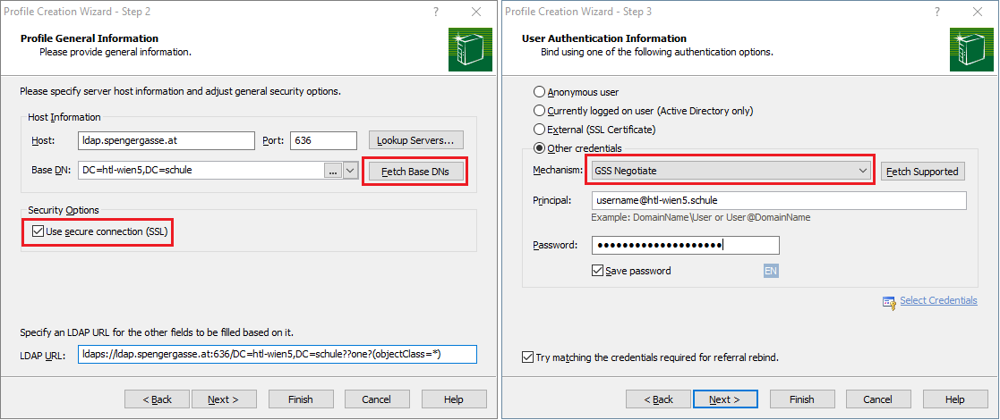

# AD Abfrage und Versand von Mails aus der Schule

Folgende NuGet Pakete werden verwendet:

- [Novell.Directory.Ldap.NETStandard](https://www.nuget.org/packages/Novell.Directory.Ldap.NETStandard/)
  zum Abfragen von Daten aus dem Active Directory
- [MailKit](https://www.nuget.org/packages/MailKit/) zum Senden von Mails über den Mailserver der Schule.

## Konfigurieren des Abfrageusers

Es gibt auch eine Login Methode ohne Parameter. Diese verwendet einen eingetragenen *Suchuser*.
Dies ist dann sinnvoll, wenn nach dem Login des Users noch Informationen abgerufen werden sollen.

Die Verbindung ist immer so kurz wie möglich offen zu halten, deswegen verwendet das Beispiel
*using var* beim Instanzieren des Services. In ASP.NET wird das Service als Transient Service
registriert.

## Ansehen der AD Daten

Um eigene Methoden zu implementieren analysiert man am Besten mit einem LDAP Browser die Inhalte
des Active Directories. Dafür lädt man sich die neueste Version von Softerra LDAP Browser
von https://www.ldapadministrator.com/download.htm#browser

Danach kann eine neue Verbindung mit folgenden Parametern erstellt werden:

